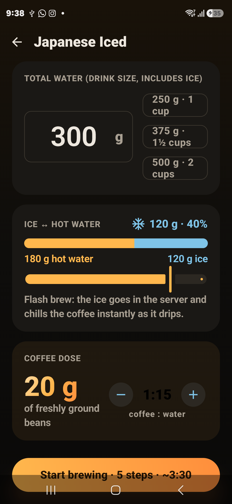
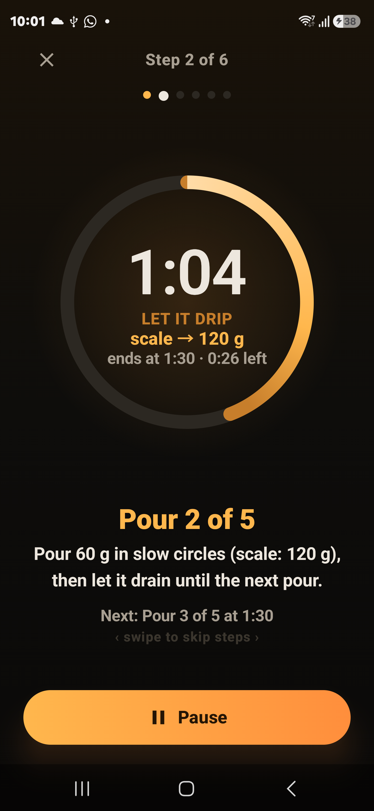

# Pourfect

A V60 pour over companion for Android. Pick a recipe, tell it how big you want your cup, and it builds the whole pour schedule and walks you through it with a live timer.

I made this because every brewing app I tried either ignored iced coffee or treated it as an afterthought. Japanese style flash brew deserves better: the ice replaces part of your brew water, so the dose, the pour targets and the grind all have to change with it. Pourfect does that math for you with a slider.

## What it does

- Seven built in recipes: Classic V60, James Hoffmann's ultimate technique, Tetsu Kasuya's 4:6 with sweetness and strength controls, Matt Winton's five pour, Scott Rao's method, osmotic flow, and Japanese iced
- An ice slider that works in grams. Drag it and the hot water, pour targets and coffee dose recalculate instantly. Every recipe can become an iced recipe
- A guided timer with a two phase ring: bright amber while you should be pouring, bronze while the bed drips. It buzzes when it's time to stop pouring, and shows the exact scale reading you should hit in each step
- Swipe left or right mid brew to skip between steps
- After the brew, tap how it tasted (bitter, sour, weak, harsh) and it tells you what to change next time: grind clicks, water temperature, ratio
- A grinder guide with starting clicks for Comandante, 1Zpresso, Timemore and Kingrinder hand grinders. Pick yours and your clicks show up right on the setup screen
- A brew journal. Every finished brew is saved with the recipe, water, ice, dose, your grinder setting and your verdict, so you can actually remember what worked
- A recipe builder for your own schedules: ratio, bloom size, pour count, seconds between pours
- Optional voice guidance that reads each step out loud, handy when both hands are busy. Ounce and Fahrenheit toggles for the imperially minded

## Screenshots

| Setup | Guided brew |
| --- | --- |
|  |  |

## Download

Grab the APK from the [latest release](../../releases/latest) and install it. You'll need Android 8.0 or newer, and you may have to allow installs from unknown sources since this isn't on the Play Store.

Privacy is simple here: the app asks for one permission (vibration), has no internet access at all, no ads, no analytics, no accounts. Your brews never leave your phone.

## Building it yourself

It's a standard Gradle project. You need JDK 17 or newer and the Android SDK (API 35).

```
git clone https://github.com/aoe-a/pourfect.git
cd pourfect
gradlew assembleDebug
```

The recipe engine is plain Kotlin with a full JUnit suite, so `gradlew testDebugUnitTest` runs everything without an emulator.

## How the recipes work

Every schedule is generated, not hardcoded. A recipe takes your total water, ice amount and ratio, and produces a list of timed steps with cumulative scale targets. Times always run from the moment you start pouring, and each pour step knows how long the active pour lasts versus how long the bed needs to drain, which is what drives the two phase ring. For iced brews the ice goes in the server before the timer starts, and the schedule only covers the hot water that actually passes through the grounds.

## License

MIT. See [LICENSE](LICENSE).
